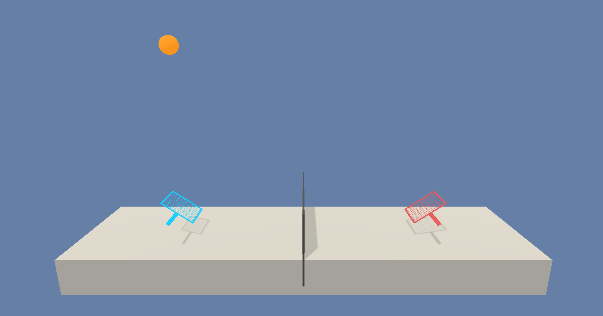
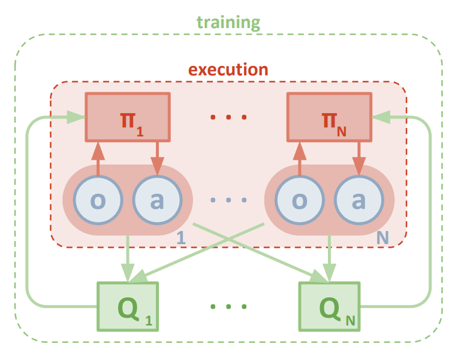
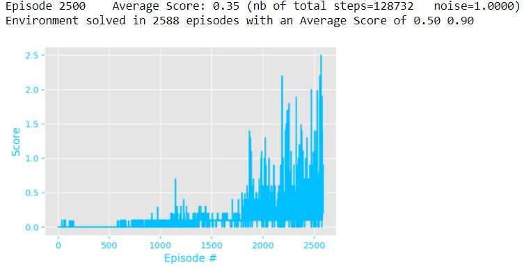

# Project 3 : Collaboration and Competition

## Project's Goal

In this environment, two agents control rackets to bounce a ball over a net. If an agent hits the ball over the net, it receives a reward of +0.1.  If an agent lets a ball hit the ground or hits the ball out of bounds, it receives a reward of -0.01.  **Thus, the goal of each agent is to keep the ball in play.**

The task is episodic, and in order to solve the environment, **the agents must get an average score of +0.5 (over 100 consecutive episodes, after taking the maximum over both agents)**. Specifically,

The environment is considered solved, when the average (over 100 episodes) of those **scores is at least +0.5.**



## Environment details

The environment is based on [Unity ML-agents](https://github.com/Unity-Technologies/ml-agents).

The observation space consists of 8 variables corresponding to the position and velocity of the ball and racket. Each agent receives its own, local observation.  Two continuous actions are available, corresponding to movement toward (or away from) the net, and jumping. 


## Learning Algorithm

### Multi Agent Deep Deterministic Policy Gradient (MADDPG)

The agent is trained with the [Multi Agent DDPG](https://arxiv.org/abs/1706.02275). The full algorithm is described in the Methods section of the paper.

The information flow in a MADDPG algorithm from the paper is depicted in the below screenshot:

 <br> 


The main concept behind this algorithm is summarized in this illustration taken from the paper :

 (screenshot from the paper)

#### Actor-Critic Method
Actor-critic methods leverage the strengths of both policy-based and value-based methods.

In short, during the training, the Critics networks have access to the states and actions information of both agents, while the Actors networks have only access to the information corresponding to their local agent.

```python
# Actor Network (w/ Target Network)
self.actor_local = Actor(state_size, action_size, random_seed).to(device)
self.actor_target = Actor(state_size, action_size, random_seed).to(device)
self.actor_optimizer = optim.Adam(self.actor_local.parameters(), lr=LR_ACTOR)

# Critic Network (w/ Target Network)
self.critic_local = Critic(state_size, action_size, random_seed).to(device)
self.critic_target = Critic(state_size, action_size, random_seed).to(device)
self.critic_optimizer = optim.Adam(self.critic_local.parameters(), lr=LR_CRITIC, weight_decay=WEIGHT_DECAY)
```

### Code implementation

The code used here is derived from the "DDPG pidedal" tutorial from the [Deep Reinforcement Learning Nanodegree](https://www.udacity.com/course/deep-reinforcement-learning-nanodegree--nd893), and modified to implement the **Multi-Agent Actor Critic**  as discussed in the Multi-Agent Udacity tutorial lesson.

#### MADDPG Parameters

```python
BUFFER_SIZE = int(1e6)   # Replay buffer size
BATCH_SIZE = 128         # Minibatch size

LR_ACTOR = 1e-3           # Learning rate of the actor 
LR_CRITIC = 1e-3          # Learning rate of the critic

LEARN_EVERY = 1           # Learning timestep interval
LEARN_NUM = 5             # Number of learning passes

WEIGHT_DECAY = 0          # L2 weight decay
GAMMA = 0.99              # Discount factor
TAU = 8e-3                # For soft update of target parameters

OU_SIGMA = 0.25           # Ornstein-Uhlenbeck noise parameter, volatility
OU_THETA = 0.15           # Ornstein-Uhlenbeck noise parameter, speed of mean reversion
EPS_START = 5.0           # Initial value for epsilon in noise decay process in Agent.act()
EPS_EP_END = 300          # Episode to end the noise decay process
EPS_FINAL = 0             # Final value for epsilon after decay
```

The Ornstein-Uhlenbeck process itself has three hyperparameters that determine the noise characteristics and magnitude:
- mu: the long-running mean
- theta: the speed of mean reversion
- sigma: the volatility parameter

#### Results

Given the chosen architecture and parameters, our results are :



**These results meet the project's expectations as the agent is able to receive an average reward (over 100 episodes) of at least +0.50 in <br> 523 episodes.** 


### Ideas for Future Work

The following techniques that can potentially further improve the performance of the network:
- [Prioritized Experience Replay](https://arxiv.org/abs/1511.05952): This technique prioritizes the experiences and chooses the best experience for further training when sampling from the buffer. This is known to reduce the training time and make the training more efficient.
- [Asynchornous Actor Critic Agent](https://medium.com/emergent-future/simple-reinforcement-learning-with-tensorflow-part-8-asynchronous-actor-critic-agents-a3c-c88f72a5e9f2): This technique trains multiple worker agents that interact with a glocal network asynchronously to optimize the policy and value function. This way, each of these agents interacts with it’s own copy of the environment at the same time as the other agents are interacting with their environments.
- [Proximal Policy Optimization](https://arxiv.org/abs/1707.06347): This technique modifies the parameters of the network in such a way that the new set of parameters is looked for in the immediate neighbourhood of the parameters in the previous iteration of the training. This is shown also to be an efficient way of training the network so the search space is more optimal. 
