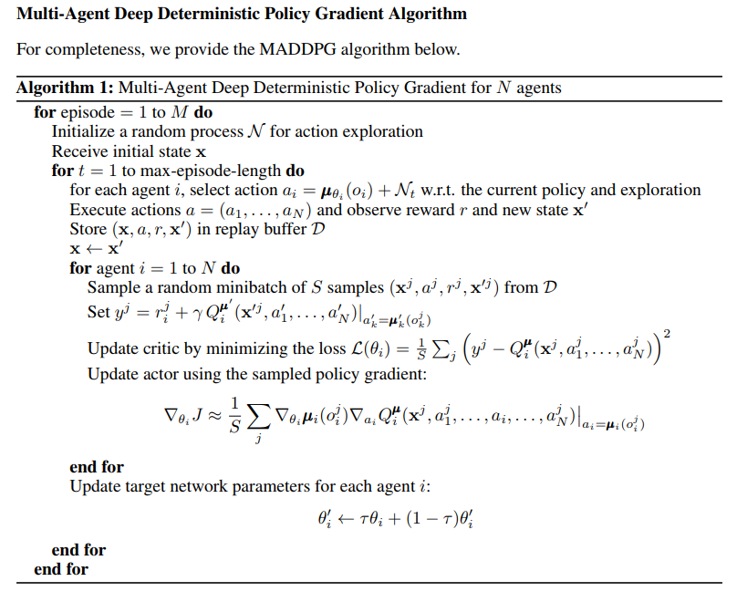

# Project 3 : Collaboration and Competition

## Project's Goal

In this environment, two agents control rackets to bounce a ball over a net. If an agent hits the ball over the net, it receives a reward of +0.1.  If an agent lets a ball hit the ground or hits the ball out of bounds, it receives a reward of -0.01.  **Thus, the goal of each agent is to keep the ball in play.**

The task is episodic, and in order to solve the environment, **the agents must get an average score of +0.5 (over 100 consecutive episodes, after taking the maximum over both agents)**. Specifically,

- After each episode, we add up the rewards that each agent received (without discounting), to get a score for each agent. This yields 2 (potentially different) scores. We then take the maximum of these 2 scores.
- This yields a single **score** for each episode.

The environment is considered solved, when the average (over 100 episodes) of those **scores is at least +0.5.**


## Environment details

The environment is based on [Unity ML-agents](https://github.com/Unity-Technologies/ml-agents). The project environment provided by Udacity is similar to the [Tennis](https://github.com/Unity-Technologies/ml-agents/blob/master/docs/Learning-Environment-Examples.md#tennis) environment on the Unity ML-Agents GitHub page.

> The Unity Machine Learning Agents Toolkit (ML-Agents) is an open-source Unity plugin that enables games and simulations to serve as environments for training intelligent agents. Agents can be trained using reinforcement learning, imitation learning, neuroevolution, or other machine learning methods through a simple-to-use Python API. 

The observation space consists of 8 variables corresponding to the position and velocity of the ball and racket. Each agent receives its own, local observation.  Two continuous actions are available, corresponding to movement toward (or away from) the net, and jumping. 

- Set-up: Two-player game where agents control rackets to bounce ball over a net.
- Goal: The agents must bounce ball between one another while not dropping or sending ball out of bounds.
- Agents: The environment contains two agent linked to a single Brain named TennisBrain. After training you can attach another Brain named MyBrain to one of the agent to play against your trained model.
- Agent Reward Function (independent):
  - +0.1 To agent when hitting ball over net.
  - -0.1 To agent who let ball hit their ground, or hit ball out of bounds.
- Brains: One Brain with the following observation/action space.
- Vector Observation space: 8 variables corresponding to position and velocity of ball and racket.
  - In the Udacity provided environment, 3 observations are stacked (8 *3 = 24 variables) 
- Vector Action space: (Continuous) Size of 2, corresponding to movement toward net or away from net, and jumping.
- Visual Observations: None.
- Reset Parameters: One, corresponding to size of ball.
- Benchmark Mean Reward: 2.5
- Optional Imitation Learning scene: TennisIL.


## Agent Implementation

This project uses an *off-policy method* called **Multi Agent Deep Deterministic Policy Gradient (MADDPG)** algorithm.

### Background for Deep Deterministic Policy Gradient (DDPG)

MADDPG find its origins in an *off-policy method* called **Deep Deterministic Policy Gradient (DDPG)** and described in the paper [Continuous control with deep reinforcement learning](https://arxiv.org/abs/1509.02971). 

> We adapt the ideas underlying the success of Deep Q-Learning to the continuous action domain. We present an actor-critic, model-free algorithm based on the deterministic policy gradient that can operate over continuous action spaces. Using the same learning algorithm, network architecture and hyper-parameters, our algorithm robustly solves more than 20 simulated physics tasks, including classic problems such as cartpole swing-up, dexterous manipulation, legged locomotion and car driving. Our algorithm is able to find policies whose performance is competitive with those found by a planning algorithm with full access to the dynamics of the domain and its derivatives. We further demonstrate that for many of the tasks the algorithm can learn policies end-to-end: directly from raw pixel inputs.

Deep Deterministic Policy Gradient (DDPG) is an algorithm which concurrently learns a Q-function and a policy. It uses off-policy data and the Bellman equation to learn the Q-function, and uses the Q-function to learn the policy.

More details available on the Open AI's [Spinning Up](https://spinningup.openai.com/en/latest/algorithms/ddpg.html) website.


This algorithm screenshot is taken from the [DDPG algorithm from the Spinning Up website](https://spinningup.openai.com/en/latest/algorithms/ddpg.html)

### Multi Agent Deep Deterministic Policy Gradient (MADDPG)

For this project I have used a variant of DDPG called **Multi Agent Deep Deterministic Policy Gradient (MADDPG)** which is  described in the paper [Multi-Agent Actor-Critic for Mixed Cooperative-Competitive Environments](https://arxiv.org/abs/1706.02275)

> We explore deep reinforcement learning methods for multi-agent domains. We begin by analyzing the difficulty of traditional algorithms in the multi-agent case: Q-learning is challenged by an inherent non-stationarity of the environment, while policy gradient suffers from a variance that increases as the number of agents grows. We then present an adaptation of actor-critic methods that considers action policies of other agents and is able to successfully learn policies that require complex multi-agent coordination. Additionally, we introduce a training regimen utilizing an ensemble of policies for each agent that leads to more robust multi-agent policies. We show the strength of our approach compared to existing methods in cooperative as well as competitive scenarios, where agent populations are able to discover various physical and informational coordination strategies.

 <br> (screenshot from the paper)


The main concept behind this algorithm is summarized in this illustration taken from the paper :

 (screenshot from the paper)

> We accomplish our goal by adopting the framework of centralized training with decentralized execution. Thus, we allow the policies to use extra information to ease training, so long as this information is not used at test time. It is unnatural to do this with Q-learning, as the Q-function generally cannot contain different information at training and test time. Thus, we propose a simple extension of actor-critic policy gradient methods where the critic is augmented with extra information about the policies of other agents.

In short, this means that during the training, the Critics networks have access to the states and actions information of both agents, while the Actors networks have only access to the information corresponding to their local agent.

### Code implementation

The code used here is derived from the "DDPG pidedal" tutorial from the [Deep Reinforcement Learning Nanodegree](https://www.udacity.com/course/deep-reinforcement-learning-nanodegree--nd893), and modified to implement the **Multi-Agent Actor Critic**  as discussed in the Multi-Agent Udacity tutorial lesson.

The code is written in [Python 3.6](https://www.python.org/downloads/release/python-360/) and is relying on [PyTorch 0.4.0](https://pytorch.org/docs/0.4.0/) framework.

The code consist of :

- `model.py` : Implement the **Actor** and the **Critic** classes.
    - The Actor and Critic classes each implement a *Target* and a *Local* Neural Networks used for the training.

- `maddpg_agent.py`: Implement the MADDPG alorithm. 
  - The `maddpg` is relying on the `ddpg` class
   - It instanciates DDPG Agents
   - It provides a helper function to save the models checkpoints
   - It provides the `step()` and `act()` methods
   - As the **Multi-Agent Actor Critic** `learn()` function slightly differs from the DDPG one, a `maddpg_learn()` method is provided here.
    - The `learn()` method updates the policy and value parameters using given batch of experience tuples.
        ```
        Q_targets = r + γ * critic_target(next_state, actor_target(next_state))
        where:
            actor_target(states) -> action
            critic_target(all_states, all_actions) -> Q-value
        ```  
    
- `ddpg_agent.py` : Implement the **DDPG agent** and a **Replay Buffer memory** used by the DDPG agent.
    - The Actor's *Local* and *Target* neural networks, and the Critic's *Local* and *Target* neural networks are instanciated by the Agent's constructor.
  
- `memory.py` : Implement the Buffer Replay Memory
    - As it is accessed by both Agents, it is instanciated in the maddpg class instead of the ddpg class.
    
- `utils.py` : Implement some helper functions to encode the states and actions before being inserted in the Replay Buffer, and decode them when a batch of experience is sampled from the Replay Buffer (I wanted the Memory Buffer code to remain unmodified, and thus be usable 'as this' for Single Agent or Multiple Agents)

- `hyperparameters.py` : Defines all the hyperparameters in constant variables. (**Important**: Don't forget to restart the Jupyter Notebook Kernel to take into account any change done to these parameters)

- `TennisProject.ipynb` : This Jupyter notebook allows to instanciate and train both the agents. Furthermore, it allows to :
  - Prepare the Unity environment and Import the necessary packages 
  - Check the Unity environment
  - Define a helper function to instanciate and train a MADDPG agent
  - Train an agent using MADDPG 
  - Plot the score results

### MADDPG Parameters and Results

#### MADDPG Parameters

The final version of my MADDPG agents uses the following parameters values (These parameters are passed in the `hyperparameters.py`  file.

```
SEED = 10                          # Random seed

NB_EPISODES = 10000                # Max nb of episodes
NB_STEPS = 1000                    # Max nb of steps per episodes 
UPDATE_EVERY_NB_EPISODE = 4        # Nb of episodes between learning process
MULTIPLE_LEARN_PER_UPDATE = 3      # Nb of multiple learning process performed in a row

BUFFER_SIZE = int(1e5)             # replay buffer size
BATCH_SIZE = 200                   # minibatch size

ACTOR_FC1_UNITS = 400              # Number of units for the layer 1 in the actor model
ACTOR_FC2_UNITS = 300              # Number of units for the layer 2 in the actor model
CRITIC_FCS1_UNITS = 400            # Number of units for the layer 1 in the critic model
CRITIC_FC2_UNITS = 300             # Number of units for the layer 2 in the critic model
NON_LIN = F.relu                   # Non linearity operator used in the model
LR_ACTOR = 1e-4                    # Learning rate of the actor 
LR_CRITIC = 5e-3   #2e-3           # Learning rate of the critic
WEIGHT_DECAY = 0                   # L2 weight decay

GAMMA = 0.995 #0.99                # Discount factor
TAU = 1e-3                         # For soft update of target parameters
CLIP_CRITIC_GRADIENT = False       # Clip gradient during Critic optimization

ADD_OU_NOISE = True                # Add Ornstein-Uhlenbeck noise
MU = 0.                            # Ornstein-Uhlenbeck noise parameter
THETA = 0.15                       # Ornstein-Uhlenbeck noise parameter
SIGMA = 0.2                        # Ornstein-Uhlenbeck noise parameter
NOISE = 1.0                        # Initial Noise Amplitude 
NOISE_REDUCTION = 1.0              # Noise amplitude decay ratio
```

The **Actor Neural Networks** use the following architecture :

```
Input nodes (8x3=24 states ) 
  -> Fully Connected Layer (400 units, Relu activation) 
    -> Batch Normlization
      -> Fully Connected Layer (300 units, Relu activation) 
         -> Ouput nodes (2 units/actions, tanh activation)
```


The **Critic Neural Networks** use the following architecture :

```
Input nodes ( [ 8x3=24 states + 2 actions ] x 2 Agents = 52  ) 
  -> Fully Connected Layer (400 units, Relu activation) 
    -> Batch Normlization
      -> Fully Connected Layer (300 units, Relu activation) 
        -> Ouput node (1 unit, no activation)
```
            

Both Neural Networks use the Adam optimizer with a learning rate of 1e-4 (actors) and 5e-3 (critics) are trained using a batch size of 200.

#### Results

Given the chosen architecture and parameters, our results are :


**These results meets the project's expectation as the agent is able to receive an average reward (over 100 episodes) of at least +0.5 in 2588 episodes** 


### Ideas for Future Work

The following techniques that can potentially further improve the performance of the network:
- [Prioritized Experience Replay](https://arxiv.org/abs/1511.05952): This technique prioritizes the experiences and chooses the best experience for further training when sampling from the buffer. This is known to reduce the training time and make the training more efficient.
- [Asynchornous Actor Critic Agent](https://medium.com/emergent-future/simple-reinforcement-learning-with-tensorflow-part-8-asynchronous-actor-critic-agents-a3c-c88f72a5e9f2): This technique trains multiple worker agents that interact with a glocal network asynchronously to optimize the policy and value function. This way, each of these agents interacts with it’s own copy of the environment at the same time as the other agents are interacting with their environments.
- [Proximal Policy Optimization](https://arxiv.org/abs/1707.06347): This technique modifies the parameters of the network in such a way that the new set of parameters is looked for in the immediate neighbourhood of the parameters in the previous iteration of the training. This is shown also to be an efficient way of training the network so the search space is more optimal. 
